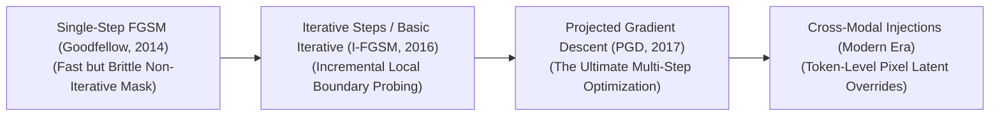

# Awesome-Fast-Gradient-Sign-Method
## Fast Gradient Sign Method (FGSM): Derivation, Progression, Variants, & Robustness

The **Fast Gradient Sign Method (FGSM)** is a foundational white-box adversarial attack framework designed to expose and evaluate vulnerabilities in machine learning architectures, particularly Deep Convolutional Neural Networks (CNNs). Formalized by Ian Goodfellow, Jonathon Shlens, and Christian Szegedy in 2014 ("Explaining and Harnessing Adversarial Examples"), FGSM dismantled the prevailing assumption that neural network misclassifications were caused solely by extreme non-linearities or overfitting. 

Instead, Goodfellow et al. demonstrated that deep models suffer from high vulnerability due to their **linear behavior in high-dimensional spaces**. FGSM computes an adversarial perturbation by taking a single, mathematically efficient step in the exact direction of the input space that *maximizes* the model's loss function. This single-step gradient sign calculation creates an adversarial input that is visually indistinguishable to human eyes but completely corrupts the model's internal latent representations.

---

## 1. Mathematical Derivation

The foundational formulation of FGSM derives an adversarial perturbation by linearizing the model's cost function around the input tensor, taking a single step scaled by an optimization boundary parameter ($\epsilon$) in the direction of the loss gradient's sign.

- ### A. The Optimization Goal
	Let $\theta$ represent the frozen parameters (weights) of a trained model, $x$ represent the original clean input vector (e.g., an image matrix), $y$ map the ground-truth target label, and $J(\theta, x, y)$ define the cost function used to train the network (such as Cross-Entropy Loss). 

	An adversarial attacker wishes to find an altered input $x_{\text{adv}} = x + \eta$ bounded by an $L_\infty$ maximum perturbation constraint $\|\eta\|_\infty \le \epsilon$ such that the model's classification loss is maximized:
	$$\max_{\|\eta\|_\infty \le \epsilon} J(\theta, x + \eta, y)$$

- ### B. Linearization of the Loss Surface
	Because deep neural networks operate over high-dimensional input arrays, we can approximate the local loss landscape around the clean sample $x$ using a first-order Taylor expansion:
	$$J(\theta, x + \eta, y) \approx J(\theta, x, y) + \eta^T \nabla_x J(\theta, x, y)$$

	To maximize this objective under the bounded vector constraint $\|\eta\|_\infty \le \epsilon$, we must maximize the dot product term $\eta^T \nabla_x J(\theta, x, y)$. 

- ### C. Solving via the Sign Function
	The mathematical vector $\eta$ that maximizes a dot product under an $L_\infty$ norm bound is achieved when every individual coordinate of $\eta$ matches the absolute upper limit ($\epsilon$) and shares the identical positive/negative sign of the corresponding gradient coordinate. 

	Let $\text{sign}(\cdot)$ represent the element-wise sign function, which maps positive numbers to $1$, negative numbers to $-1$, and zero to $0$. We isolate the optimal perturbation vector as:
	$$\eta = \epsilon \cdot \text{sign}\left(\nabla_x J(\theta, x, y)\right)$$

	Appending this step directly to the original, clean input canvas establishes the definitive FGSM equation:
	$$x_{\text{adv}} = x + \epsilon \cdot \text{sign}\left(\nabla_x J(\theta, x, y)\right)$$

---

## 2. The Macro Chronological Evolution

The technical implementation of gradient-based exploitation has transitioned from rapid single-step mathematical shifts to fine-grained multi-step iterative optimizations and automated cross-modal prompt subversions.

*   **The Single-Step Linearization Era (Vanilla FGSM, 2014–2015)**
    *   *Concept:* The historical baseline that launched the field of adversarial machine learning. It treated adversarial synthesis as a low-cost, single-pass calculus step. By evaluating the gradient signature once, it proved that models could be blinded instantly with near-zero computational overhead.
    *   *Limitation:* Highly brittle and easily defended. Because it calculates a coarse, single-step linearization, the synthesized perturbation frequently overshoots the true local decision boundary, failing to transfer across alternative model graphs.
*   **The Basic Iterative & Step Splitting Era (I-FGSM / BIM, 2016)**
    *   *Concept:* Overcame single-step boundaries by breaking the perturbation loop into multiple smaller, incremental updates. Introduced by Kurakin et al. as the **Basic Iterative Method (BIM)**, it splits the global step ($\epsilon$) into multiple fine-grained sub-steps ($\alpha$), intermediate clipping operations to hold the tensor within safe boundaries after each pass.
    *   *Significance:* Radically increased attack success rates, ensuring the perturbation closely hugs the model's true non-linear decision hyperplanes.
*   **The Projected Gradient Descent Universal Standard (PGD, Madry et al., 2017)**
    *   *Concept:* Polished iterative optimization into a mathematically rigorous, minimax baseline framework. **Projected Gradient Descent (PGD)** initiates the loop by injecting a random uniform noise offset into the input vector before starting the iterative gradient sign steps, recursively projecting the tensor back into an $L_\infty$ or $L_2$ ball boundary.
    *   *Significance:* Celebrated as the ultimate first-order white-box adversarial attack baseline, forming the standard benchmark used to evaluate model robustness globally.
*   **The Multi-Modal & Latent Token Override Era (~2024–Present)**
    *   *Concept:* The current modern state-of-the-art security frontier. Moves past simple image pixel disruption to target unified **Vision-Language Models (VLMs)** and foundation architectures.
    *   *Significance:* Instead of targeting standalone CNN classifiers, optimized gradient-sign algorithms compute adversarial multi-modal patch masks. Appending a corrupted pixel layer to a graphic causes the VLM's vision encoder to emit latent token projections that completely override text system prompts, triggering indirect prompt injections and safety guardrail bypasses invisibly.

---

## 3. Core Algorithmic & Strategic Variants

The FGSM lineage features specialized mathematical variations engineered to enforce targeted classifications, introduce momentum coefficients, or minimize hardware gradient calculations.

- ### A. Non-Targeted FGSM (Maximizing Cross-Entropy)
	*   **Mechanism:** The baseline formulation. It calculates gradients to maximize the model's cost function with respect to the *correct ground-truth label*, driving the model's prediction away from its true state into an arbitrary incorrect category.

- ### B. Targeted FGSM (Directional Subversion)
	*   **Mechanism:** Restructures the optimization graph to force the model to output a highly specific, incorrect target class ($y_{\text{target}}$) chosen by the attacker. It computes gradients to *minimize* the cost function with respect to that false target:
	    $$x_{\text{adv}} = x - \epsilon \cdot \text{sign}\left(\nabla_x J(\theta, x, y_{\text{target}})\right)$$

- ### C. Momentum Iterative FGSM (MI-FGSM)
	*   **Mechanism:** Integrates a momentum velocity constant ($\mu$) straight into the iterative gradient calculation steps, smoothing out step trajectories to prevent the optimizer from getting stuck in poor, localized local extrema.
	*   **Pros:** Radically increases the **adversarial transferability** of perturbations, allowing an attack calculated over an offline substitute model to easily break a hidden cloud API.

- ### D. Fast Adversarial Training (Fast FGSM)
	*   **Mechanism:** Repurposes FGSM from an offensive exploit tool into a high-speed defensive regularizer. Developed by Wong et al., it injects random initialization noise followed by a single-step FGSM calculation during every batch pass of pre-training, providing robust PGD-level model hardening at a fraction of the traditional training compute cost.

---

## 4. Production Engineering Challenges & Hardening Countermeasures

Deploying and scaling adversarial defense frameworks across enterprise AI serving nodes introduces intense computational and parameter accuracy trade-offs.

*   **The Computational Overhead Wall of Robust Training**
    *   *The Problem:* The most effective way to harden an architecture against FGSM and PGD variants is **Adversarial Training**—explicitly optimizing the model weights over online-generated adversarial samples during every step of pre-training. However, running inner optimization loops to compute gradients with respect to inputs multiplies baseline model training duration by up to $3\times$ to $10\times$, creating massive infrastructure bottlenecks.
    *   *Mitigation:* Implementing **Fast FGSM schedules with mixed-precision arithmetic (FP16/BF16 operators)**, caching intermediate activation tensors cleanly inside fast register arrays to minimize global High Bandwidth Memory read/write cycles.
*   **The Robustness vs. Clean Accuracy Trade-Off (The Alignment Tax)**
    *   *The Problem:* Enforcing strict certified adversarial robustness boundaries alters the geometry of a model's latent representation manifolds. Forcing the network to ignore low-level high-frequency gradient features makes it less sensitive, frequently resulting in minor accuracy drops on standard, non-corrupted human datasets.
    *   *Mitigation:* Implementing **TRADES loss optimization parameters**, which introduce a tunable regularization dial to let infrastructure engineering teams precisely balance clean data precision against strict certified robustness ceilings based on the deployment domain.

---

## 5. Frontier Real-World AI Security Applications

*   **Autonomous Vehicle Vision Array Hardening**
    *   *Application:* Secures the computer vision perception stacks of autonomous vehicles and drones against physical-world spatial exploits. Engineering teams use multi-scale iterative FGSM variants to evaluate cameras against universal adversarial stickers (such as localized patch patterns applied to stop signs that fool standard CNNs into reading a speed limit sign), utilizing robust adversarial pre-training to guarantee safe navigation bounds.
*   **Biometric Facial Recognition Evasion & Spoofing Audits**
    *   *Application:* Hardens high-security physical checkpoints and authentication infrastructure. Security modules evaluate facial-matching backbones against adversarial eyewear frames or printed mask textures synthesized via targeted gradient-sign loops, forcing model parameters to isolate genuine, sub-surface liveness traits over superficial pixel configurations.
*   **Cross-Modal Foundation Agent Red-Teaming (VLM Guardrails)**
    *   *Application:* Secures multimodal enterprise tool-orchestration systems against indirect injections. Red-teaming orchestrators deploy discrete token-space gradient-sign methods to discover and patch hidden pixel vulnerabilities within corporate document-parsing loops, preventing malicious graphics from hijacking an agent's backend function-calling privileges.

---

## References
1. Szegedy, C., et al. (2013). Intriguing properties of neural networks. *arXiv preprint arXiv:1312.6199*.
2. Goodfellow, I. J., Shlens, J., & Szegedy, C. (2014). Explaining and harnessing adversarial examples. *International Conference on Learning Representations (ICLR)*.
3. Kurakin, A., Goodfellow, I., & Bengio, S. (2016). Adversarial examples in the physical world. *arXiv preprint arXiv:1607.02533*.
4. Madry, A., et al. (2018). Towards deep learning models resistant to adversarial attacks. *International Conference on Machine Learning (ICML)*.
5. Dong, Yinpeng, et al. (2018). Boosting adversarial attacks with momentum. *Proceedings of the IEEE Conference on Computer Vision and Pattern Recognition (CVPR)*, 9185-9187.
6. Wong, E., Rice, L., & Kolter, J. Z. (2020). Fast is better than free: Revisiting adversarial training. *International Conference on Learning Representations (ICLR)*.

---

To advance this documentation repository, secure development context, or threat-modeling framework, consider exploring these adjacent development pathways:
* Build a **Python script using PyTorch and Torchattacks** illustrating how to write an automated adversarial generation pipeline that calculates and applies a targeted FGSM perturbation mask over an input image tensor block.
* Generate a **comprehensive Markdown table** explicitly comparing Vanilla FGSM, Basic Iterative Method (BIM/I-FGSM), Momentum Iterative FGSM (MI-FGSM), and Projected Gradient Descent (PGD) across time complexities, mathematical vector norms ($L_\infty$ vs. $L_2$), requirement for multi-step gradient calculation budgets, and adversarial transferability performance.
* Establish an **automated performance profiling suite using Triton** to track the exact computational throughput, VRAM cache utilization, and processing latency metrics achieved when compiling a fused randomized input smoothing operation directly inside high-speed GPU SRAM registers.

***

**Follow-Up Options Matrix:**

Before updating this documentation repository layout, let me know how you would like to proceed by choosing one of the options below:
* I can provide a **complete Python code boilerplate using PyTorch** demonstrating how to write a manual, non-targeted Fast Gradient Sign Method function from scratch.
* I can generate a **Markdown matrix table** tracking the maximum perturbation boundaries ($\epsilon$), step scales, and empirical robustness scores of the leading open-weight vision backbones.
I can write a detailed technical explanation focusing on the mathematics of Randomized Smoothing and how it provides provable, certified robustness bounds against first-order gradient manipulations.
***

**Follow-Up Navigation Matrix:**
To advance this conversation or documentation workspace, consider exploring these adjacent development pathways:
* I can provide a **complete Python code boilerplate using PyTorch** demonstrating how to write a manual, non-targeted Fast Gradient Sign Method function from scratch.
* I can generate a **Markdown matrix table** tracking the maximum perturbation boundaries (ε), step scales, and empirical robustness scores of the leading open-weight vision backbones.
* I can write a detailed technical explanation focusing on the **mathematics of Randomized Smoothing** and how it provides provable, certified robustness bounds against first-order gradient manipulations.

