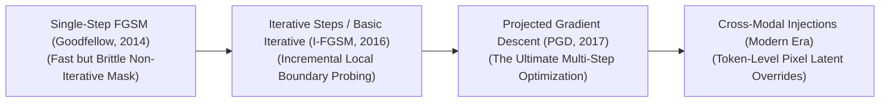

# Awesome-Fast-Gradient-Sign-Method

  

## Fast Gradient Sign Method (FGSM): Derivation, Progression, Variants, & Robustness

The **Fast Gradient Sign Method (FGSM)** is a foundational white-box adversarial attack framework designed to expose and evaluate vulnerabilities in machine learning architectures, particularly Deep Convolutional Neural Networks (CNNs). Formalized by Ian Goodfellow, Jonathon Shlens, and Christian Szegedy in 2014 ("Explaining and Harnessing Adversarial Examples"), FGSM dismantled the prevailing assumption that neural network misclassifications were caused solely by extreme non-linearities or overfitting. 

Instead, Goodfellow et al. demonstrated that deep models suffer from high vulnerability due to their **linear behavior in high-dimensional spaces**. FGSM computes an adversarial perturbation by taking a single, mathematically efficient step in the exact direction of the input space that *maximizes* the model's loss function. This single-step gradient sign calculation creates an adversarial input that is visually indistinguishable to human eyes but completely corrupts the model's internal latent representations.

---

## 🧮 1. Mathematical Derivation

The foundational formulation of FGSM derives an adversarial perturbation by linearizing the model's cost function around the input tensor, taking a single step scaled by an optimization boundary parameter ($\epsilon$) in the direction of the loss gradient's sign.

- ### A. The Optimization Goal
	Let $\theta$ represent the frozen parameters (weights) of a trained model, $x$ represent the original clean input vector (e.g., an image matrix), $y$ map the ground-truth target label, and $J(\theta, x, y)$ define the cost function used to train the network (such as Cross-Entropy Loss). 

	An adversarial attacker wishes to find an altered input $x_{\text{adv}} = x + \eta$ bounded by an $L_\infty$ maximum perturbation constraint $\|\eta\|_\infty \le \epsilon$ such that the model's classification loss is maximized:
	$$\max_{\|\eta\|_\infty \le \epsilon} J(\theta, x + \eta, y)$$

- ### B. Linearization of the Loss Surface
	Because deep neural networks operate over high-dimensional input arrays, we can approximate the local loss landscape around the clean sample $x$ using a first-order Taylor expansion:
	$$J(\theta, x + \eta, y) \approx J(\theta, x, y) + \eta^T \nabla_x J(\theta, x, y)$$

	To maximize this objective under the bounded vector constraint $\|\eta\|_\infty \le \epsilon$, we must maximize the dot product term $\eta^T \nabla_x J(\theta, x, y)$. 

- ### C. Solving via the Sign Function
	The mathematical vector $\eta$ that maximizes a dot product under an $L_\infty$ norm bound is achieved when every individual coordinate of $\eta$ matches the absolute upper limit ($\epsilon$) and shares the identical positive/negative sign of the corresponding gradient coordinate. 

	Let $\text{sign}(\cdot)$ represent the element-wise sign function, which maps positive numbers to $1$, negative numbers to $-1$, and zero to $0$. We isolate the optimal perturbation vector as:
	$$\eta = \epsilon \cdot \text{sign}\left(\nabla_x J(\theta, x, y)\right)$$

	Appending this step directly to the original, clean input canvas establishes the definitive FGSM equation:
	$$x_{\text{adv}} = x + \epsilon \cdot \text{sign}\left(\nabla_x J(\theta, x, y)\right)$$

---

## ⏳ 2. The Macro Chronological Evolution

The technical implementation of gradient-based exploitation has transitioned from rapid single-step mathematical shifts to fine-grained multi-step iterative optimizations and automated cross-modal prompt subversions.

| Era/Method | Year | Paper Link | Description |
|---|---|---|---|
| [The Single-Step Linearization Era (Vanilla FGSM, 2014–2015)](pages/vanilla-fgsm.md) | 2014 | [Goodfellow et al.](https://arxiv.org/abs/1412.6572) | The historical baseline that launched the field... |
| [The Basic Iterative & Step Splitting Era (I-FGSM / BIM, 2016)](pages/basic-iterative-method.md) | 2016 | [Kurakin et al.](https://arxiv.org/abs/1607.02533) | Overcame single-step boundaries by breaking the perturbation... |
| [The Projected Gradient Descent Universal Standard (PGD, Madry et al., 2017)](pages/pgd.md) | 2017 | [Madry et al.](https://arxiv.org/abs/1706.06083) | Polished iterative optimization into a mathematically rigorous... |
| [The Multi-Modal & Latent Token Override Era (~2024–Present)](pages/multi-modal-vlm.md) | 2024 | [Recent Works](#) | The current modern state-of-the-art security frontier... |

---

## 🧬 3. Core Algorithmic & Strategic Variants

The FGSM lineage features specialized mathematical variations engineered to enforce targeted classifications, introduce momentum coefficients, or minimize hardware gradient calculations.

| Variant | Year | Paper Link | Description |
|---|---|---|---|
| [Non-Targeted FGSM (Maximizing Cross-Entropy)](pages/non-targeted-fgsm.md) | 2014 | [Goodfellow et al.](https://arxiv.org/abs/1412.6572) | The baseline formulation driving prediction away from true state. |
| [Targeted FGSM (Directional Subversion)](pages/targeted-fgsm.md) | 2014 | [Goodfellow et al.](https://arxiv.org/abs/1412.6572) | Forces the model to output a highly specific, incorrect target class. |
| [Momentum Iterative FGSM (MI-FGSM)](pages/momentum-iterative-fgsm.md) | 2018 | [Dong et al.](https://arxiv.org/abs/1710.06081) | Integrates a momentum velocity constant to prevent getting stuck in local extrema. |
| [Fast Adversarial Training (Fast FGSM)](pages/fast-fgsm.md) | 2020 | [Wong et al.](https://arxiv.org/abs/2001.03994) | Repurposes FGSM from an offensive exploit tool into a high-speed defensive regularizer. |

---

## ⚙️ 4. Production Engineering Challenges & Hardening Countermeasures

Deploying and scaling adversarial defense frameworks across enterprise AI serving nodes introduces intense computational and parameter accuracy trade-offs.

| Challenge | Year | Paper Link | Description |
|---|---|---|---|
| [The Computational Overhead Wall of Robust Training](pages/computational-overhead.md) | 2017 | [Madry et al.](https://arxiv.org/abs/1706.06083) | Intense computational overhead for adversarial training. |
| [The Robustness vs. Clean Accuracy Trade-Off (The Alignment Tax)](pages/alignment-tax.md) | 2019 | [Zhang et al.](https://arxiv.org/abs/1901.08573) | Accuracy drops on standard datasets due to robust boundaries. |

---

## 🛡️ 5. Frontier Real-World AI Security Applications

| Application | Year | Paper Link | Description |
|---|---|---|---|
| [Autonomous Vehicle Vision Array Hardening](pages/av-vision-hardening.md) | 2018 | [Eykholt et al.](https://arxiv.org/abs/1807.10471) | Secures computer vision stacks against physical-world spatial exploits. |
| [Biometric Facial Recognition Evasion & Spoofing Audits](pages/facial-recognition-evasion.md) | 2016 | [Sharif et al.](https://arxiv.org/abs/1610.04618) | Hardens physical checkpoints and authentication infrastructure. |
| [Cross-Modal Foundation Agent Red-Teaming (VLM Guardrails)](pages/vlm-guardrails.md) | 2024 | [Modern Audits](#) | Secures multimodal systems against indirect injections. |

---

## 📚 References
1. Szegedy, C., et al. (2013). Intriguing properties of neural networks. *arXiv preprint arXiv:1312.6199*.
2. Goodfellow, I. J., Shlens, J., & Szegedy, C. (2014). Explaining and harnessing adversarial examples. *International Conference on Learning Representations (ICLR)*.
3. Kurakin, A., Goodfellow, I., & Bengio, S. (2016). Adversarial examples in the physical world. *arXiv preprint arXiv:1607.02533*.
4. Madry, A., et al. (2018). Towards deep learning models resistant to adversarial attacks. *International Conference on Machine Learning (ICML)*.
5. Dong, Yinpeng, et al. (2018). Boosting adversarial attacks with momentum. *Proceedings of the IEEE Conference on Computer Vision and Pattern Recognition (CVPR)*, 9185-9187.
6. Wong, E., Rice, L., & Kolter, J. Z. (2020). Fast is better than free: Revisiting adversarial training. *International Conference on Learning Representations (ICLR)*.

---

To advance this documentation repository, secure development context, or threat-modeling framework, consider exploring these adjacent development pathways:
| Pathway | Year | Paper Link | Description |
|---|---|---|---|
| [Build a Python script using PyTorch and Torchattacks](pages/pytorch-torchattacks-script.md) | 2020 | [Torchattacks](https://github.com/Harry24k/adversarial-attacks-pytorch) | Automated adversarial generation pipeline. |
| [Generate a comprehensive Markdown table explicitly comparing variants](pages/variant-comparison-table.md) | 2024 | [N/A](#) | Compare time complexities, mathematical vector norms, etc. |
| [Establish an automated performance profiling suite using Triton](pages/triton-performance-profiling.md) | 2024 | [N/A](#) | Track computational throughput, VRAM utilization, etc. |

***

**Follow-Up Options Matrix:**

Before updating this documentation repository layout, let me know how you would like to proceed by choosing one of the options below:
* I can provide a **complete Python code boilerplate using PyTorch** demonstrating how to write a manual, non-targeted Fast Gradient Sign Method function from scratch.
* I can generate a **Markdown matrix table** tracking the maximum perturbation boundaries ($\epsilon$), step scales, and empirical robustness scores of the leading open-weight vision backbones.
I can write a detailed technical explanation focusing on the mathematics of Randomized Smoothing and how it provides provable, certified robustness bounds against first-order gradient manipulations.
***

**Follow-Up Navigation Matrix:**
To advance this conversation or documentation workspace, consider exploring these adjacent development pathways:
* I can provide a **complete Python code boilerplate using PyTorch** demonstrating how to write a manual, non-targeted Fast Gradient Sign Method function from scratch.
* I can generate a **Markdown matrix table** tracking the maximum perturbation boundaries (ε), step scales, and empirical robustness scores of the leading open-weight vision backbones.
* I can write a detailed technical explanation focusing on the **mathematics of Randomized Smoothing** and how it provides provable, certified robustness bounds against first-order gradient manipulations.

##  Star History

<a href="https://www.star-history.com/?repos=ishandutta2007%2FAwesome-Fast-Gradient-Sign-Method&type=date&legend=bottom-right">
<picture>
<source media="(prefers-color-scheme: dark)" srcset="https://api.star-history.com/chart?repos=ishandutta2007/Awesome-Fast-Gradient-Sign-Method&type=date&theme=dark&legend=bottom-right" />
<source media="(prefers-color-scheme: light)" srcset="https://api.star-history.com/chart?repos=ishandutta2007/Awesome-Fast-Gradient-Sign-Method&type=date&legend=bottom-right" />

</picture>
</a>

